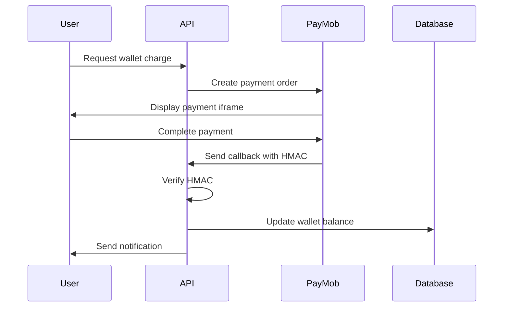

# 🚌 CityBus Management System

A comprehensive bus management platform built with ASP.NET Core that enables real-time bus tracking, booking management, and seamless communication between passengers, drivers, and administrators.

## 📋 Table of Contents

- [Features](#features)
- [Tech Stack](#tech-stack)
- [Architecture](#architecture)
- [Getting Started](#getting-started)
- [API Documentation](#api-documentation)
- [Real-Time Features](#real-time-features)
- [Payment Integration](#payment-integration)
- [Project Structure](#project-structure)

## ✨ Features

### For Passengers
- 🎫 **Smart Booking System**: Book tickets with automatic seat availability validation
- 💰 **Digital Wallet**: Secure payment integration with PayMob
- 📍 **Location Services**: Find nearest stations based on your location
- 🔔 **Real-Time Notifications**: Get notified when your bus is approaching (15, 10, 5 minutes)
- 🚏 **Route Planning**: View complete trip routes with station details
- 📊 **Booking History**: Track all your past and upcoming bookings

### For Drivers
- 📅 **Schedule Management**: View and manage daily schedules
- 🚦 **Trip Status Updates**: Start, cancel, or complete trips
- 📈 **Performance Statistics**: Track total trips, completed trips, and cancellations
- 🔄 **Real-Time Location Sharing**: Automatic location updates via SignalR

### For Administrators
- 👥 **User Management**: Handle passenger and driver accounts
- 🚌 **Fleet Management**: Manage buses, routes, stations, and schedules
- 📝 **Driver Requests**: Review and approve/reject driver applications
- 🎟️ **Pricing Management**: Configure ticket prices based on bus types and distances
- 📊 **System Monitoring**: Track bookings, schedules, and system performance

## 🛠️ Tech Stack

### Backend
- **Framework**: ASP.NET Core 9.0
- **Database**: SQL Server with Entity Framework Core
- **Authentication**: ASP.NET Identity + JWT
- **Real-Time**: SignalR
- **Background Jobs**: Hangfire
- **Caching**: IMemoryCache
- **Logging**: Serilog
- **Mapping**: Mapster

### Payment Integration
- **Payment Gateway**: PayMob (Card payments)
- **Security**: HMAC verification for callbacks

### External Services
- **Email**: SMTP (Gmail)
- **Routing**: OpenRouteService API
- **Distance Calculation**: Haversine formula + OpenRouteService

## 🏗️ Architecture

The project follows a clean architecture pattern with three main layers:

```
CityBus.Core/              # Domain entities and business logic
├── Entities/              # Domain models (Bus, Driver, Station, etc.)

Data_Access_Layer/         # Data access and repository pattern
├── Repositries/           # Repository implementations
├── DataLayer/             # DTOs and data models
└── Helpers/               # Utility classes

Service_Layer/             # Business logic and services
├── Services/              # Service implementations
└── IServices/             # Service interfaces

City_Bus_Management_System/  # API layer
├── Controllers/           # API endpoints
├── Hubs/                  # SignalR hubs
└── wwwroot/               # Static files
```

## 🚀 Getting Started

### Prerequisites

- .NET 9.0 SDK
- SQL Server
- Visual Studio 2022 or VS Code

### Installation

1. **Clone the repository**
```bash
git clone https://github.com/yourusername/citybus-management-system.git
cd citybus-management-system
```

2. **Configure the database**

Update the connection string in `appsettings.json`:
```json
{
  "constr": "Server=YOUR_SERVER;Database=CityBusDB;User Id=YOUR_USER;Password=YOUR_PASSWORD;"
}
```

3. **Set up environment variables**

Create a `.env` file or set the following environment variables:
```
PAYMOP_API_KEY=your_paymob_api_key
PAYMOP_INTEGRATION_ID=your_integration_id
PAYMOP_IFRAME_ID=your_iframe_id
HMAC_SECRET_KEY=your_hmac_secret
```

4. **Run migrations**
```bash
dotnet ef database update
```

5. **Run the application**
```bash
dotnet run --project City_Bus_Management_System
```

The API will be available at `https://localhost:7147`

## 📚 API Documentation

### Authentication Endpoints

```http
POST /Auth/LogIn
POST /Auth/Register
POST /Auth/ForgetPassword/{email}
POST /Auth/ResetPassword
POST /Auth/VerifyCode/{code}
POST /Auth/DriverRequest
POST /Auth/RefreshToken
POST /Auth/RevokeToken
```

### Booking Endpoints

```http
GET  /Booking                    # Get all bookings (Admin)
GET  /Booking/{passengerId}      # Get passenger bookings
POST /Booking                    # Create booking
PATCH /Booking/cancel/{id}       # Cancel booking
PUT  /Booking/{id}               # Update booking
```

### Station Endpoints

```http
GET  /Station                           # Get all stations
GET  /Station/{name}                    # Get station by name
GET  /Station/GetStationByArea/{area}   # Get stations by area
GET  /Station/GetTheNearestStation      # Find nearest station
POST /Station                           # Add station (Admin)
PUT  /Station/{id}                      # Update station (Admin)
DELETE /Station/{id}                    # Delete station (Admin)
```

### Wallet Endpoints

```http
GET  /Wallet/{passengerId}              # Get wallet balance
PUT  /Wallet/{amount}/{passengerId}     # Charge wallet
POST /Wallet/callback                   # PayMob callback
```

## 🔄 Real-Time Features

### Bus Tracking

The system uses SignalR for real-time bus location updates:

```javascript
// Driver sends location
connection.invoke("SendLocationUpdate", driverId, latitude, longitude);

// Passenger receives updates
connection.on("ReceiveLocationUpdate[tripId]", (busId, lat, long) => {
    // Update UI with bus location
});
```

### Notifications

Passengers receive real-time notifications for:
- Bus approaching boarding station (15, 10, 5 minutes)
- Bus approaching arrival station (15, 10, 5 minutes)
- Booking confirmations
- Wallet transactions

```javascript
connection.on("ReceiveNotification", (notification) => {
    // Handle notification
});
```

## 💳 Payment Integration

The system integrates with PayMob for secure payments:

1. **Charge Wallet**: Generates a PayMob iframe URL
2. **Payment Processing**: User completes payment in iframe
3. **Callback Verification**: HMAC verification for security
4. **Balance Update**: Automatic wallet credit on success

### Payment Flow



## 📁 Project Structure

### Key Components

- **Entities**: Domain models with relationships
- **DTOs**: Data transfer objects for API communication
- **Repositories**: Data access layer with generic repository pattern
- **Services**: Business logic implementation
- **Controllers**: RESTful API endpoints
- **Hubs**: SignalR hubs for real-time communication
- **Background Jobs**: Hangfire for scheduled tasks

### Key Features Implementation

#### 1. Seat Availability Management
- Thread-safe booking with `ConcurrentDictionary`
- Real-time seat count tracking per trip
- Automatic validation before booking

#### 2. Location-Based Services
- Haversine formula for distance calculation
- OpenRouteService API for accurate routing
- Nearest station finder algorithm

#### 3. Time Zone Handling
- Custom `EgyptTimeHelper` for consistent time management
- UTC storage with local time conversion
- Schedule validation based on Egyptian Standard Time

#### 4. Notification System
- Multi-passenger notification support
- Configurable notification intervals
- Station approach tracking

## 🔐 Security Features

- JWT-based authentication with refresh tokens
- Role-based authorization (Admin, Driver, Passenger)
- HMAC verification for payment callbacks
- Password reset with secure tokens
- Email verification for new accounts
- Account lockout on failed login attempts

## 📊 Database Schema

### Key Entities

- **ApplicationUser**: Base user with Identity
- **Passenger/Driver**: User type extensions
- **Bus**: Fleet vehicles with types and capacities
- **Station**: Bus stops with GPS coordinates
- **Trip**: Routes between stations
- **Route**: Station sequences in trips
- **Schedule**: Driver-Bus-Trip assignments
- **Booking**: Passenger reservations
- **Wallet**: Digital payment accounts
- **Ticket**: Pricing based on distance and bus type
- **Notification**: System alerts

## 🧪 Testing

### Manual Testing Files

The project includes HTML test clients:
- `index.html` (Driver): Simulates GPS tracking
- `index.html` (Passenger): Real-time bus tracking

## 📈 Performance Optimizations

- **Caching**: IMemoryCache for frequently accessed data
- **Split Queries**: Optimized EF Core queries
- **Async/Await**: Non-blocking operations
- **Rate Limiting**: API endpoint protection
- **Connection Pooling**: Database connection optimization

## 🤝 Contributing

Contributions are welcome! Please follow these steps:

1. Fork the repository
2. Create a feature branch (`git checkout -b feature/AmazingFeature`)
3. Commit your changes (`git commit -m 'Add some AmazingFeature'`)
4. Push to the branch (`git push origin feature/AmazingFeature`)
5. Open a Pull Request

## 📞 Support

For support, email waselny615@gmail.com or create an issue in the repository.

## 🙏 Acknowledgments

- OpenRouteService for routing API
- PayMob for payment processing
- SignalR for real-time capabilities
- The ASP.NET Core community

---

**Built with ❤️ by the CityBus Team**
